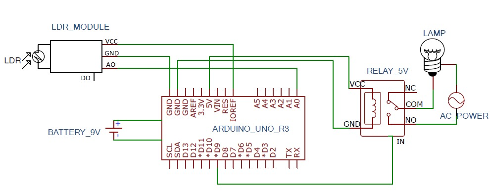

# Automatic Outdoor Lighting Control System

An Arduino-based automation project that uses a Light Dependent Resistor (LDR)
to control an AC lighting circuit based on ambient light conditions.  
The system automatically switches the load ON during low-light conditions
and OFF when sufficient natural light is available, improving energy efficiency.

---

## Project Overview

This project demonstrates the practical application of sensor-based automation
using an Arduino microcontroller. An LDR sensor continuously monitors ambient
light intensity, and based on predefined threshold values, the Arduino triggers
a relay module to control an AC lighting load.

The system supports both **digital control** and **analog control** modes,
allowing flexible sensitivity adjustment depending on environmental conditions.

---

## Features

- Automatic ON/OFF control based on ambient light intensity
- Digital and analog control modes
- Energy-efficient lighting automation
- Simple and cost-effective design
- Suitable for outdoor and indoor lighting applications

---

## Circuit Diagram

The following diagram shows the interfacing of the LDR sensor module, relay
module, and Arduino Uno used in this project.

## Hardware Components

- Arduino Uno
- LDR Sensor Module
- 5V Relay Module
- AC Bulb (Demo Load)
- Connecting Wires
- External Power Supply

---

## Software Details

- Platform: Arduino IDE
- Language: Arduino (C++)
- Microcontroller: ATmega328P

---

## Working Principle

The LDR sensor detects changes in ambient light intensity and provides an
analog or digital signal to the Arduino microcontroller. When the detected
light level falls below a predefined threshold, the Arduino activates the
relay module, turning the AC lighting load ON. When the light level exceeds
the threshold, the relay is deactivated, turning the load OFF.

This automation ensures optimal lighting while minimizing unnecessary
energy consumption.

---

## Project Documentation

The complete project report, including circuit diagrams, implementation
procedure, experimental results, and analysis, is available in the `docs/`
directory.

---

## Applications

- Automatic street lighting systems
- Home lighting automation
- Parking lot lighting control
- Energy-efficient outdoor illumination

---

## Future Enhancements

- Integration with IoT platforms for remote monitoring
- Adaptive thresholding using environmental data
- Replacement of relay with solid-state switching
- Power consumption monitoring

---

## License

This project is intended for academic and educational purposes.
